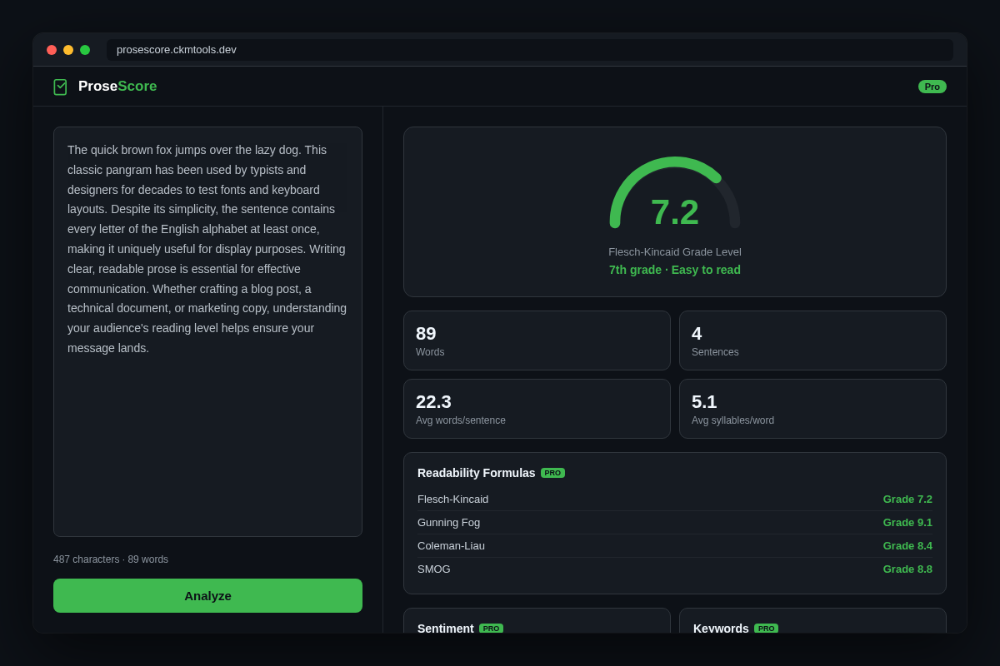
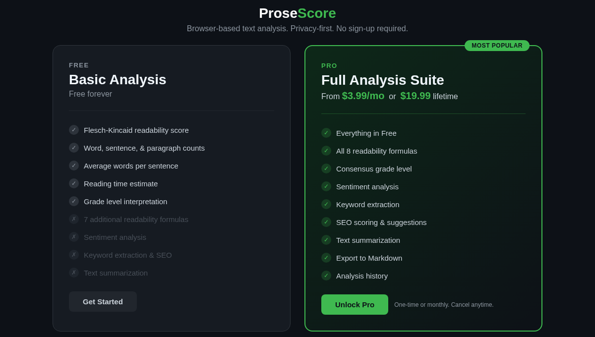
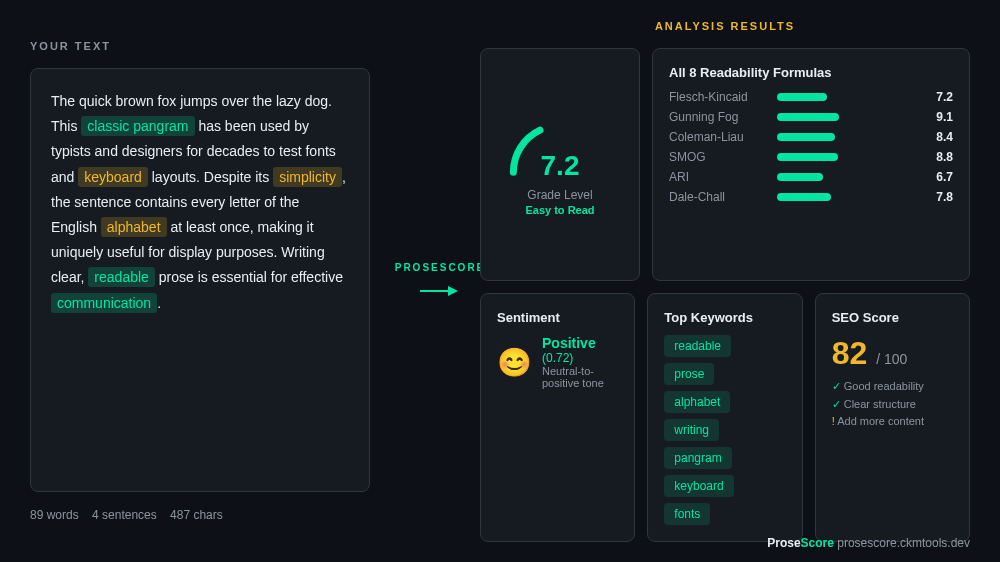

# ProseScore

Free browser-based readability analyzer with 8 formulas, sentiment analysis, and SEO scoring.

**[Open the live app](https://prosescore.ckmtools.dev/)**

## Features

### Free

- Flesch-Kincaid readability score
- Word, sentence, and paragraph count
- Reading time estimate
- Character count
- Average word and sentence length
- Grade-level recommendation

### Pro ($3.99/mo or $19.99 lifetime)

- 8 readability formulas (Flesch-Kincaid, Gunning Fog, Coleman-Liau, SMOG, ARI, Dale-Chall, Linsear Write, Spache)
- Consensus grade across all formulas
- Sentiment analysis
- Keyword extraction
- SEO scoring
- Text summarization
- Markdown export
- Analysis history
- File upload (.txt, .md, .docx)
- Dark and light mode

## Privacy

ProseScore runs entirely client-side. No data is sent to any server. Your text never leaves the browser.

## How it works

Paste or upload text. Get instant analysis. Built on [textlens](https://www.npmjs.com/package/textlens). No account needed for free features.

## Tech stack

- Pure HTML, CSS, and JavaScript
- [textlens](https://www.npmjs.com/package/textlens) readability engine
- Hosted on Cloudflare Pages
- Stripe for payments

## License

[MIT](LICENSE)
